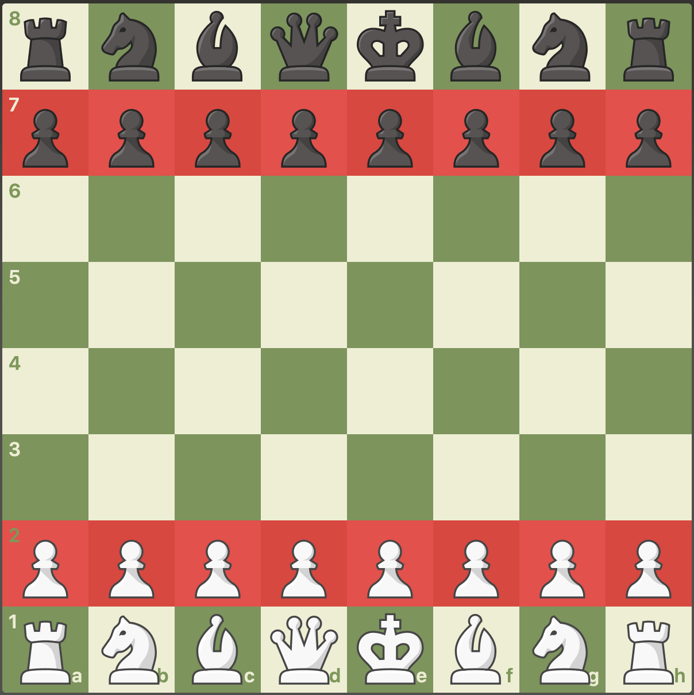

# Chess-Board-Game

# Requirements
- Standard board ( 8 x 8 )
- Two player game
- Computer player can play 
- ( Human Vs Computer)
- ( Human vs Human)
- ( Computer Vs Computer )
- Every piece has their own rule to play.

## Pieces:
- Pawns 
- Rook
- Knight
- Bishop
- King
- Queen



```


+----------------+
|   ChessGame    |
+----------------+
| - Board board  |
| - turn: Color  |
+----------------+
| + startGame()  |
| + movePiece()  |
+----------------+
|
| 1
|
▼
+----------------+
|     Board      |
+----------------+
| - List<List<ChessCell>> grid  |
+----------------+
| + initialize() |
| + getCell(x, y)|
+----------------+
|
| 64 (8x8)
|
▼
+----------------+
|  ChessCell     |
+----------------+
| - Pair position |
| - PieceColor color |
| - Optional<Piece> piece |
+----------------+
| + getPiece()    |
| + setPiece()    |
+----------------+
|
| 0..1
|
▼
+----------------+
|     Piece      |  (Abstract)
+----------------+
| - PieceName name  |
| - PieceColor color |
+----------------+
| + move()  |
+----------------+
|    ▲   ▲   ▲   ▲   ▲   ▲
|    |   |   |   |   |   |
|    |   |   |   |   |   |
|  Pawn Rook Bishop Knight Queen King (Concrete)
|
|
+----------------+
|    Pair        | (Helper Class)
+----------------+
| - int x       |
| - int y       |
+----------------+
| + getX()      |
| + getY()      |
+----------------+

+----------------+
|   PieceColor   | (Enum)
+----------------+
| WHITE         |
| BLACK         |
+----------------+

+----------------+
|   PieceName    | (Enum)
+----------------+
| PAWN, ROOK, KNIGHT, ... |
+----------------+
```
